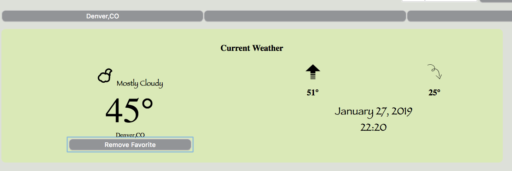

# Sweater Weather Front End
https://mstang15.github.io/sweater_weather_fe/

This application is written in javascript and it dogfoods the Sweater Weather API that was built on Ruby on Rails. 
You can find the backend here: https://github.com/mstang15/sweater_weather

<h1>App Overview</h1>

When a user visits the app, they are taken to a screen that allows them to log in (for now it is a default log in). Once the user is logged in, they can see any loaded favorites. If it is their first time on the app, there will appear to be no favorites, such as in the picture below. The app only allows users to favorite up to five cities. 

)

After a user either selects their favorite or types in a new city, the weather data is displayed. On the page, the user can see current weather, both short and detailed. They can also see the forecast for the next 8 hours and the following 5 days. 


A user is able to favorite and remove favorites from the app. Once a user adds a favorite, it is displayed in the favorite bar. A user can click on the favorites in the favorite bar to change the content of their screen. 



## Initial Setup

1. Clone this starter kit repository and rename the repository to anything you'd like in one command:

  ```shell
  git clone git@github.com:turingschool-projects/self-directed-fe-starter.git <name of your choice>
  ```
2. Change into the new director directory.

3. Remove the default remote (origin):

  ```shell
  git remote rm origin
  ```

4. Create a new repository on GitHub.

5. Add your new repository remote - **your remote URL and user name will be different in the command below**

  ```shell
  git remote add origin git@github.com:<YOUR GITHUB NAME>/<PROJECT NAME>.git
  ```

6. Install the dependencies of the starter kit:

  ```shell
  npm install
  ```

7. Add, commit, and push up to your repository:

  ```shell
  git add .
  git commit -m "Initial commit using starter kit"
  git push origin master
  ```

## Running the Server Locally

To see your code in action locally, you need to fire up a development server. Use the command:

```shell
npm start
```

Once the server is running, visit in your browser:

* `http://localhost:8080/` to run your application.


## GitHub Pages Setup

This site will be served from GitHub Pages in production.

In order to see your application running on production:

1. From the command line, run `npm run build`.

2. Commit and push your application to GitHub.

3. Visit your repository on Github

4. Go to Settings

5. Under the Github Pages section of Options, select 'master' as your source and click `Save`

Be sure to `npm run build` and commit before each push to master. A few seconds after you push up, you should be able to see your application at <https://your-github-username.github.io/project-name>.


## Built With

* [JavaScript](https://www.javascript.com/)
* [jQuery](https://jquery.com/)
* [Express](https://expressjs.com/)
* [Mocha](https://mochajs.org/)
* [Chai](https://chaijs.com/)
